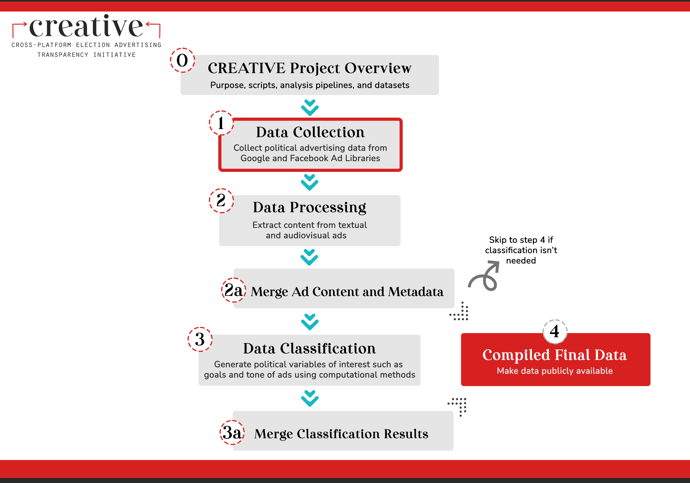

# Wesleyan Media Project - fb_pd_id

Welcome! The purpose of this repository is to generate and store the Facebook entity identifiers: "pd_id" --- a unique identifier that links the Facebook ads to their corresponding political entities without the reliance on FEC identifiers.

This repo is a part of the [Cross-platform Election Advertising Transparency Initiative (CREATIVE)](https://www.creativewmp.com/). CREATIVE has the goal of providing the public with analysis tools for more transparency of political ads across online platforms. In particular, CREATIVE provides cross-platform integration and standardization of political ads collected from Google and Facebook. CREATIVE is a joint project of the [Wesleyan Media Project (WMP)](https://mediaproject.wesleyan.edu/) and the [privacy-tech-lab](https://privacytechlab.org/) at [Wesleyan University](https://www.wesleyan.edu).

To analyze the different dimensions of political ad transparency we have developed an analysis pipeline. The scripts in this repo are part of the Data Collection Step in our pipeline.



## Table of Contents

- [1. Overview](#1-overview)
- [2. Setup](#2-setup)
- [3. Thank You](#3-thank-you)

## 1. Overview

Wesleyan Media Project tracks the amount of money spent by political actors on advertising during electoral campaigns. Because Facebook does not require advertisers to provide FEC identifiers, WMP has to link the Facebook ads to political candidates on its own. Technically, an ad is run from a single page. A page is uniquely identified by its id. However, some pages engage in an activity where they run ads for various organizations and candidates. This is revealed in the `PFB` - "paid for by" string, also known as "disclaimer" or "funding entity", in an ad's record. Such activity is especially widespread among pages backed by interest groups - they would run ads promoting one candidate, then run ads in support of another candidate. The page id stays the same, but the disclaimer string is different.

Thus, the full information about the funders of an ad is contained in the combination of a page id and the disclaimer string. For this reason, WMP generates what internally is known as "pd_ids" - a string combining Facebook's page id and a numeric code for the `PFB` string used by that page. This repository provides the scripts used to generate and store the fb_pd_id strings.

The main script is `update_fb_pd_id.R`. It interacts with the table of ads `race2022` and the table of pd_ids - `fb_pd_id`.
The table `race2022` is populated by the scripts `race2022.R` and `backpull2022.R` that are described in the `fb_ads_import` [repository](https://github.com/Wesleyan-Media-Project/fb_ads_import).

This script retrieves all combinations of page ids and disclaimers from the table of ads. Then it removes the combinations that are already present in the `fb_pd_id` table. After that, it generates numeric codes for the new disclaimer strings for each of the page ids. Then it writes the final snapshot of ad IDs and disclaimers to a CSV file named `pd_id_snapshot.csv`. This csv file contains unique combinations of page_id, disclaimer, pd_id, and op_num. The final steps involve inserting the new rows into the `fb_pd_id` table in MySQL database and also storing a copy of the `fb_pd_id` in Google BigQuery.

The copying of `fb_pd_id` to BigQuery is done by the `load_fb_pd_id.sh` script that uses Unix command line interpreter bash. The script is launched as a subprocess inside the `update_fb_pd_id.R` script.

## 2. Setup

We suggest you run this repository after you have run all the [Data Collection Repositories](https://github.com/Wesleyan-Media-Project/creative_overview?tab=readme-ov-file#step-1-data-collection) so that you will have a complete dataset of facebook ads in your MySQL database and a Google Cloud Platform Project with BigQuery enabled.

Before you run the scripts in this repository, you need to set up the following dependencies:

- A MySQL database with the `race2022` , `fb_lifelong` tables already present in your database. Those tables are generated by the repos [fb_ads_import](https://github.com/Wesleyan-Media-Project/fb_ads_import) and [fb_agg_reports_import](https://github.com/Wesleyan-Media-Project/fb_agg_reports_import).
- A Google Cloud Platform Project with BigQuery enabled. You need to have a service account key for this project. In the shell script `load_fb_pd_id.sh`, we assume you have your Google Could Project named `wmp-sandbox` and a service account key named `wmp-sandbox.json`. The [Google Ads Archive](https://github.com/Wesleyan-Media-Project/google_ads_archive) repository provides a detailed guide on how to set up a Google Cloud Platform Project and use BigQuery. In addition, you can find the instructions on how to create a service account key [here](https://cloud.google.com/iam/docs/creating-managing-service-account-keys).

To run the scripts in this repository, you can follow the steps below:

1. Install the required R packages by running the following command in your R console:

    ```R
    install.packages("dplyr")
    install.packages("RMySQL")
    install.packages("readr")
    ```

2. Replace the placeholders for the user, password, and dbname in the `dbConnect` function with actual values from your MySQL setup in the `update_fb_pd_id.R` script.

3. After you have set up the MySQL connection, you can run the `update_fb_pd_id.R` script in your R console or through the command:

    ```shell
    Rscript update_fb_pd_id.R
    ```

    Running the script `update_fb_pd_id.R` will automatically call the `load_fb_pd_id.sh` script to copy the `fb_pd_id` table to BigQuery.

## 3. Thank You

<p align="center"><strong>We would like to thank our financial supporters!</strong></p><br>

<p align="center">This material is based upon work supported by the National Science Foundation under Grant Numbers 2235006, 2235007, and 2235008.</p>

<p align="center" style="display: flex; justify-content: center; align-items: center;">
  <a href="https://www.nsf.gov/awardsearch/showAward?AWD_ID=2235006">
    
  </a>
</p>

<p align="center">The Cross-Platform Election Advertising Transparency Initiative (CREATIVE) is a joint infrastructure project of the Wesleyan Media Project and privacy-tech-lab at Wesleyan University in Connecticut.

<p align="center" style="display: flex; justify-content: center; align-items: center;">
  <a href="https://www.creativewmp.com/">
    
  </a>
</p>

<p align="center" style="display: flex; justify-content: center; align-items: center;">
  <a href="https://mediaproject.wesleyan.edu/">
    
  </a>
</p>

<p align="center" style="display: flex; justify-content: center; align-items: center;">
  <a href="https://privacytechlab.org/" style="margin-right: 20px;">
    
  </a>
</p>
